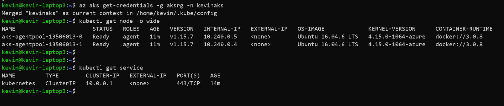

# 部署认知服务的容器到China Azure上的AKS群集
---
微软云**Azure**的认知服务包含五大类几十个具体的人工智能服务，可以帮助您创建相应的应用程序服务于各种场景，可以参考[Azure认知服务的官方文档](https://azure.microsoft.com/zh-cn/services/cognitive-services/)。


这些认知服务除了提供云端服务的能力，很多服务也同时推出了容器版本，用户可以直接将认知服务的能力以容器的形式部署在本地基础架构、边缘服务器中。

本地部署认知服务时，容器会每15分钟访问云端的计费接口，只统计计费相关的信息。因此，本地部署时，也需要在云端创建相应的服务，以便于获得容器正常运行所需要的Key和连接的端点(endpoint)。

当然也可以将这些容器部署在Kubernetes群集中，本文则已Azure托管的Kubernetes服务**AKS**进行部署认知服务的容器。


## 前提条件
* 准备China Azure账号。可以申请[免费试用](https://wd.azure.cn/zh-cn/pricing/1rmb-trial-full)。
* 访问认知服务容器  
目前有些认知服务的容器是公开的，比如LUIS自然语言理解、关键词提前、语言检测以及观点分析等等，有些还处于预览状态，需要[申请](https://docs.microsoft.com/zh-cn/azure/cognitive-services/cognitive-services-container-support)才能获得。申请也非常简单，不需要付费，直接网上填写申请表格即可。

## 环境准备
* [安装Azure CLI](https://docs.azure.cn/zh-cn/cli/install-azure-cli?view=azure-cli-latest)

建议安装最新版本，本实例要求运行 Azure CLI 2.0.64 版或更高版本。Azure CLI既可以访问China Azure，也可以访问全球Azure。  
访问China Azure需要设置：  
```
az cloud set -n AzureChinaCloud
```
访问全球Azure需要设置：  
```
az cloud set -n AzureCloud
```
* 安装kubectl  
```
az aks install-cli
```
## 创建Azure认知服务
创建认知服务中具体的服务，比如人脸识别，自然语言理解，文本转语音等等，这个过程与创建其他Azure服务一样，登录Azure Portal或者使用Azure CLI进行服务创建都非常简单，这儿不具体说明了。本文以创建语音服务为例，贴出部分截图供参考。


创建的语音服务，记录下相应的Key和Endpoint信息，在部署容器时需要使用。


## 创建AKS群集
可以参考[使用Azure门户部署AKS群集](https://docs.azure.cn/aks/kubernetes-walkthrough-portal)，或者[使用Azure CLI创建AKS群集](https://docs.azure.cn/zh-cn/aks/kubernetes-walkthrough)  
下面是具体步骤的截图，供参考：
* 选择Kubernetes Services进行创建
* 填写群集名称、区域等基本信息
* 认证选项保持默认，启用RBAC
* 网络设置可以保持默认Basic。如果需要使用Virtual Nodes则必须使用Advanced网络选项
* 其他选项保持默认。创建成功后可查看overview页面
* 在insights页面可以看到相关组件的监控状态信息
* 创建的AKS集群，需要基础架构相关资源的支撑。比如，VM，存储，网络等等组件，Azure会在AKS cluster创建时将这些底层资源单独创建在另外一个资源组中，这个资源组的名称规则是`MC_<aks resource group name>_<aks name>_<aks location>` 
* 创建AKS完成后，在客户端建立和AKS cluster的连接

## 获得认知服务的容器
可以从下面两篇文章中申请和获得认知服务众多的AI能力的容器

[Azure认知服务中的容器](https://docs.microsoft.com/zh-cn/azure/cognitive-services/cognitive-services-container-support#containers-in-azure-cognitive-services)

[具体容器的Registry](https://docs.microsoft.com/zh-cn/azure/cognitive-services/containers/container-image-tags)

以文本转语音(TTS)为例，可以看到默认的容器路径是`containerpreview.azurecr.io/microsoft/cognitive-services-text-to-speech`。

tag是latest的具有 en-US 区域设置和 en-US-JessaRUS 语音的容器映像。

如果要使用中文，可以使用tag为`1.3.0-amd64-zh-cn-kangkang-apollo-preview`，即完整的容器引用为`containerpreview.azurecr.io/microsoft/cognitive-services-text-to-speech:1.3.0-amd64-zh-cn-kangkang-apollo-preview`

可以看到TTS的容器目前是需要申请才能获得的，申请方式前文已提到。而对于registry是`mcr.microsoft.com/azure-cognitive-services`的容器，则已经都是公开的了，大家可以自行下载测试。


## Create a secret based on existing Docker credentials
kubectl create secret docker-registry <secret-name> --docker-server=containerpreview.azurecr.io --docker-username=<username> --docker-password=<pwd>